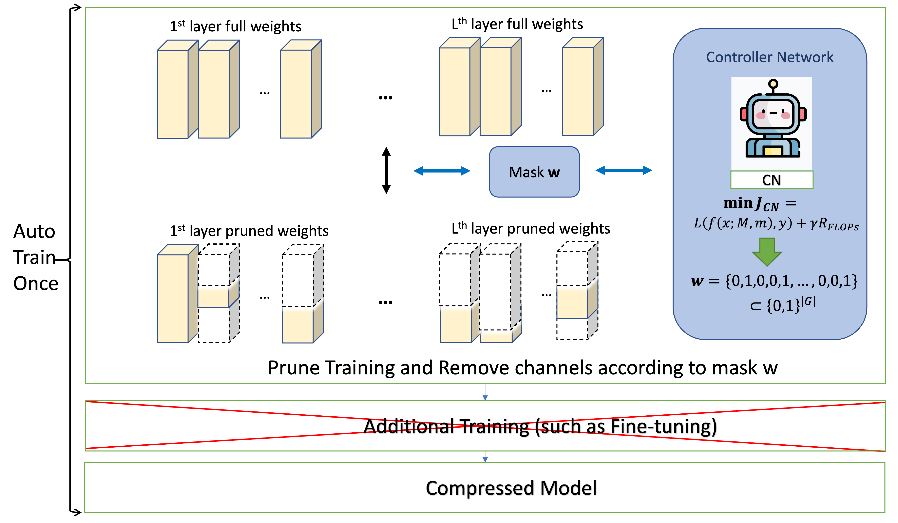

# Auto-Train-Once: Controller Network Guided Automatic Network Pruning from Scratch

This repository is the Pytorch implementation of **Auto-Train-Once** (**ATO**). ATO is an automatic network pruning algorithm designed to dynamically reduce the computational and storage costs of DNN with a controller network. It can train and prune deep learning models automatically and completely end-to-end. After model training, we can directly obtain the compressed
model without additional fine-tuning steps. Importantly, our method does not rely on the specific projectors compared with OTO and OTOv2. Additionally, we provide a comprehensive complexity analysis to ensure the convergence of our algorithm, covering both the general non-adaptive optimizer (e.g. SGD) and the adaptive optimizer (e.g. ADAM).


<div align="center">
	
</div>

## Runing
ResNet-50 with 71.2% FLOAPs reduction
since The FLOAPs of ResNet-50 is 4.12283G and prunabe FLOAPs are 3.63588G, p = 0.193

```bash
CUDA_VISIBLE_DEVICES=0,1,2,3,4,5,6,7 nohup python -u main.py --arch resnet50 --workers 16 --stage train-gate --weight-decay 5e-2 --mix_up True --p 0.193  --batch-size 1024 --lr 1e-3 --opt_name ADAMW --gates 2 --epoch 245 --start_epoch_hyper 25 --start_epoch_gl 50 --lmd 0 --grad_mul 5 --reg_w 4.0 ./Data/ILSVRC2012/
```

ResNet-34

```bash
CUDA_VISIBLE_DEVICES=0,1,2,3 nohup python -u main.py --arch resnet34 --workers 16 --stage train-gate --weight-decay 5e-2 --mix_up True --p 0.54 --batch-size 512 --lr 1e-3 --opt_name ADAMW --gates 2 --epoch 245 --start_epoch_hyper 25 --start_epoch_gl 50 --lmd 0 --grad_mul 5 --reg_w 4.0 ./Data/ILSVRC2012/ 
```


## Citation

If you find the repo useful, please kindly star this repository and cite our papers:

```bibtex


@inproceedings{wu2024ato,
  title={Auto-Train-Once: Controller Network Guided Automatic Network Pruning
from Scratch},
  author={Wu, Xidong and  Gao, Shangqian and Zhang, Zeyu and Li, Zhenzhen and  Bao, Runxue and Zhang, Yanfu and Wang, Xiaoqian and Huang, Heng},
  booktitle={Proceedings of the IEEE/CVF Conference on Computer Vision and Pattern Recognition},
  year={2024}
}
